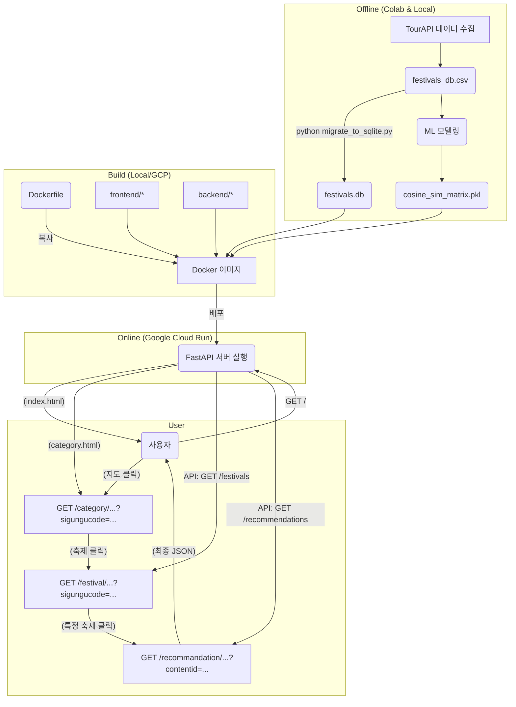

# 🧭 Festival Compass in Seoul

**[Dataup contest 2025] 서울시 외국인 관광객의 '관광 쏠림' 문제 해결을 위한 특색 문화 체험 추천 솔루션**

-----

## 1\. 👥 팀 구성 및 역할 (4인 기준)

  * **[Role 1] ML/Backend (본인)**
      * 핵심 추천 모델 (TF-IDF, Cosine Similarity) 개발
      * FastAPI를 사용한 백엔드 API 서버 구축 및 배포
  * **[Role 2] 기획 및 디자인**
      * UX/UI 디자인 (Figma)
      * 최종 발표 PPT 및 대본 제작
  * **[Role 3] Frontend**
      * 사용자 인터페이스(UI) 개발 (Static HTML/CSS/JS)
      * 백엔드 API와 데이터 연동
  * **[Role 4] Database**
      * API 데이터 수집 및 전처리 (`3_detailed_TourAPI_collect.ipynb`)
      * 운영용 데이터베이스(SQLite) 구축 및 마이그레이션

-----

## 2\. 🎯 프로젝트 목표 (Problem Definition)

### 1\) 현상 (The Problem): 관광 쏠림

'관광 빅데이터 API' 분석 결과, 서울을 방문하는 외국인 관광객의 방문지는 **중구(명동), 마포구(홍대), 종로구(궁궐) 등 소수 지역에 심각하게 편중**되어 있습니다.

### 2\) 원인 (The Root Cause): 정보 격차

이 쏠림 현상은 명백한 \*\*'정보 격차(Information Gap)'\*\*에서 비롯됩니다. TourAPI의 '국문' 정보와 '영문' 정보를 비교 분석한 결과, 외국인 관광객에게 제공되는 정보는 **양적으로 절대 부족**합니다. (예: 국문 축제 정보 240건 vs 영문 58건)

### 3\) 해결책 (Our Solution): 맞춤형 추천

우리는 이 '정보 격차'를 해소하기 위해, **풍부한 '국문' 데이터를 기반**으로 ML 모델을 구축합니다. 이 모델은 외국인 관광객이 발견하지 못했던 \*\*'숨겨진 특색 행사'\*\*를 발굴하고 추천하여, 획일화된 관광 경험을 다양화하고 **'쏠림 현상'을 완화**합니다.

-----

## 3\. 💡 핵심 MVP 로직 (User's Point 1)

우리 솔루션은 "쏠림 현상 해소"라는 명확한 목표를 위해 **두 가지 트랙(Two-Track)으로 추천**을 제공합니다.

  * **Track 1: "You might also like:" (유사도 Top N)**
      * 선택한 행사와 텍스트(콘텐츠)가 가장 유사한 행사를 추천하여 사용자의 만족도를 높입니다.
      * *(예: '가락몰 빵축제' → '가락 옥토버페스트')*
  * **Track 2: "How about these areas?" (비인기 지역구 Top N)**
      * 유사도가 높으면서, '빅데이터 API' 분석 결과 정의된 \*\*'비인기 지역구(방문율 하위 10곳)'\*\*에 속하는 행사를 추천합니다.
      * *(예: '가락몰 빵축제' (송파구) → '서대문 봄빛축제' (서대문구))*

이 로직은 `backend/app/main.py`의 `get_recommendations` 함수에 구현되어 있습니다.

-----

## 4\. ⚙️ ML 모델 로직 및 선정 (User's Point 2)

### 1\) 모델 선정: TF-IDF + Cosine Similarity

  * **선정 이유:** 프로젝트의 핵심은 \*\*"축제 개요(overview) 텍스트"\*\*를 기반으로 한 콘텐츠 기반 필터링입니다.
  * **TF-IDF + Cosine Similarity**는 이 시나리오에서 가장 고전적이면서도 효율적인 접근 방식입니다. 모델 파일(`cosine_sim_matrix.pkl`)의 크기가 매우 작아(500kb 미만) 무료 호스팅(GCR)에서 메모리 문제 없이 서빙이 가능합니다.

### 2\) 모델 로직

모델은 \*\*'Offline 학습'\*\*과 \*\*'Online 서빙'\*\*으로 분리됩니다. (아키텍처 그림 참조)

  * **Offline (in Colab):**

    1.  `3_detailed_TourAPI_collect.ipynb`에서 수집한 데이터(`festivals_db.csv`)의 'overview' 텍스트를 로드합니다.
    2.  `konlpy` (Okt)로 한국어 명사를 토큰화합니다.
    3.  `TfidfVectorizer`로 텍스트를 벡터화합니다.
    4.  `cosine_similarity`로 모든 행사 간의 유사도 행렬(N x N)을 계산합니다.
    5.  결과물(`cosine_sim_matrix.pkl`, `contentid_to_index.pkl`)을 `backend/models/`에 저장합니다.

  * **Online (in `main.py`):**

    1.  FastAPI 서버 시작 시(`lifespan`) `.pkl` 파일들을 RAM에 미리 로드합니다.
    2.  `/recommendations/{content_id}` 요청이 오면, 메모리에 있는 행렬을 조회하여 실시간으로 추천 결과를 반환합니다.

-----

## 5\. 🔄 데이터 흐름 및 아키텍처 (User's Point 3)

본 프로젝트는 API 서버와 프론트엔드 파일을 하나의 Docker 컨테이너로 묶어 Google Cloud Run에 배포하는 **통합 서버(Monolithic) 아키텍처**를 사용합니다.

### 1\) 데이터 흐름



### 2\) 기술 스택 (Tech Stack)

  * **Data Analysis & ML:** `Python`, `Pandas`, `Scikit-learn` (TF-IDF, Cosine Similarity), `Konlpy`
  * **Backend:** `FastAPI`
  * **Frontend (MVP):** `HTML`, `CSS`, `JavaScript` (Static)
  * **Database (MVP):** `SQLite`
  * **Deployment:** `Docker`, `Google Cloud Run (GCR)`
  * **Data Sources:** `TourAPI (KorService2, DataLabService)`

-----

## 6\. 📊 현재 진행 상황 및 개선점 (User's Point 4)

### 1\) 현재 진행 상황 (MVP 완료)

  * **데이터 분석:** '관광 쏠림' 현상 및 '정보 격차' 원인 분석 완료.
  * **ML 모델:** `cosine_sim_matrix.pkl` 등 모델 파일 생성 완료.
  * **데이터베이스:** `festivals_db.csv`를 `festivals.db` (SQLite)로 마이그레이션 완료.
  * **백엔드 API:** 'Two-Track' 추천(`GET /recommendations`) 및 지역별 축제 목록(`GET /festivals`) API 개발 완료.
  * **프론트엔드:** 피그마(`figma1_1.png` \~ `figma4.png`) 기반의 4페이지 흐름이 API와 연동되어 **동적으로 작동(Live)** 하도록 구현 완료.
  * **통합 및 배포:** FastAPI가 프론트엔드 파일 서빙과 API를 모두 처리하도록 통합 완료했으며, `Dockerfile`을 통해 Google Cloud Run에 성공적으로 배포했습니다.

### 2\) 차후 개선점

  * **프론트엔드 고도화:**
      * 현재의 정적 HTML/JS 구조를 **React** 또는 **Next.js**와 같은 모던 프레임워크로 마이그레이션하여 컴포넌트 기반의 동적 렌더링을 구현합니다.
  * **ML 모델 추가:**
      * 기획 단계에 있던 '특색 카테고리(K-Means)' 모델을 `5_ML_modeling.ipynb`에서 구현하고, `GET /categories` 엔드포인트를 신설합니다.
  * **데이터베이스 최적화:**
      * `lifespan`에서 SQLite DB 전체를 Pandas DataFrame으로 로드하는 대신, API 호출 시마다 필요한 데이터만 `SELECT` 쿼리로 조회하도록 변경하여 메모리 사용량을 최적화합니다.

-----

## 7\. 🗂️ 프로젝트 구조

```
.
├── Dockerfile              # GCR 배포용
├── howToDeploy.md          # GCR 배포 가이드
├── README.md               # (본 파일)
│
├── backend/
│   ├── app/
│   │   ├── main.py           # FastAPI 서버 (API + 정적 파일 서빙)
│   │   └── __init__.py
│   ├── data/
│   │   ├── festivals.db      # SQLite 데이터베이스
│   │   └── festivals_db.csv  # (원본 데이터)
│   ├── models/
│   │   └── cosine_sim_matrix.pkl # 코사인 유사도 행렬
│   ├── migrate_to_sqlite.py    # DB 마이그레이션 스크립트
│   └── requirements.txt        # 백엔드 의존성
│
├── frontend/
│   ├── index.html            # (Figma 1) 메인 지도
│   ├── style.css             # 공통 스타일시트
│   ├── script.js             # 공통 스크립트 (쿼리 스트링, API 호출)
│   └── category/
│       ├── category.html     # (Figma 2) 카테고리 선택
│       └── festival/
│           ├── festival.html # (Figma 3) 축제 목록
│           └── recommandation/
│               └── recommandation.html # (Figma 4) 상세 및 추천
│
└── notebooks/                # 데이터 분석 및 모델링 과정
    ├── 1_bigDataAPI_collect.ipynb
    ├── 2_bigDataAPI_visualization.ipynb
    ├── 3_detailed_TourAPI_collect.ipynb
    ├── 4_contents_analysis.ipynb
    └── 5_ML_modeling.ipynb
```

-----

## 8\. 🚀 실행하기 (How to Run)

### 1\) 로컬에서 실행 (Local)

1.  **DB 마이그레이션 (최초 1회):**
    `backend` 폴더로 이동하여 `festivals.db` 파일을 생성합니다.

    ```bash
    cd backend
    pip install -r requirements.txt
    python migrate_to_sqlite.py
    ```

2.  **서버 실행:**
    ( `backend` 폴더에서) `uvicorn` 서버를 실행합니다.

    ```bash
    uvicorn app.main:app --reload
    ```

3.  웹 브라우저에서 `http://127.0.0.1:8000`에 접속합니다.

### 2\) Google Cloud Run 배포 (Deploy / Update)

로컬에서 코드를 수정한 뒤, 프로젝트 루트 폴더(`Dockerfile`이 있는 위치)에서 다음 명령어를 실행하면 자동으로 새 버전이 빌드 및 배포됩니다.

(상세 가이드는 `howToDeploy.md` 참조)

```bash
# [YOUR_PROJECT_ID]와 [SERVICE_NAME]을 본인 값으로 변경
gcloud run deploy [SERVICE_NAME] \
    --source . \
    --platform managed \
    --region asia-northeast3 \
    --allow-unauthenticated \
    --project=[YOUR_PROJECT_ID]
```

